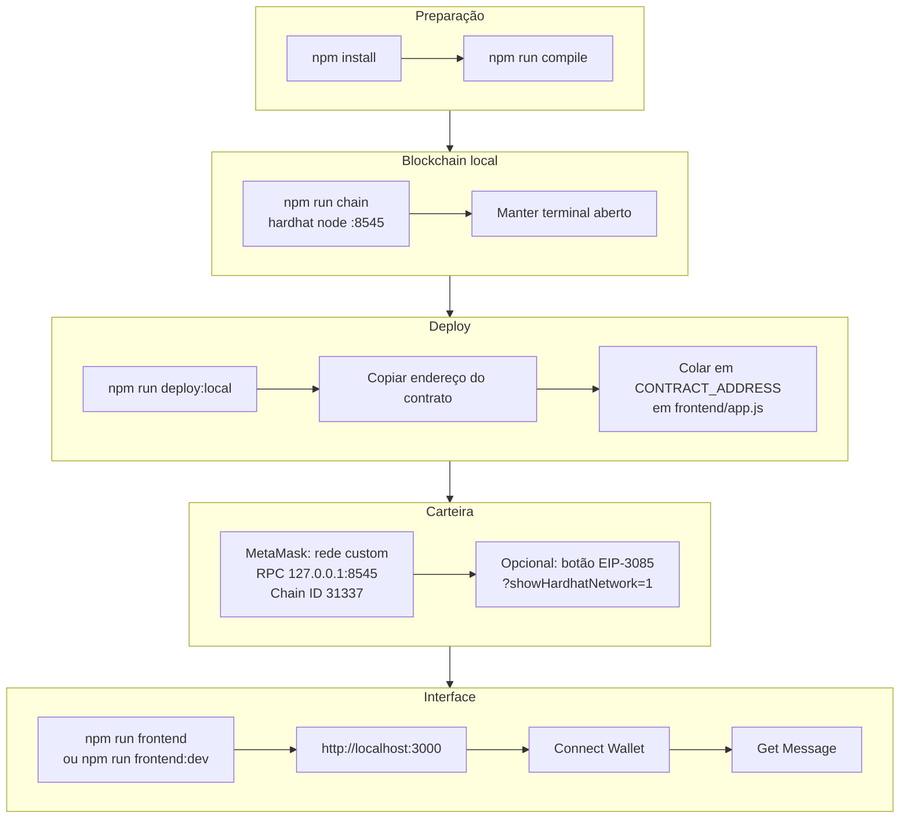
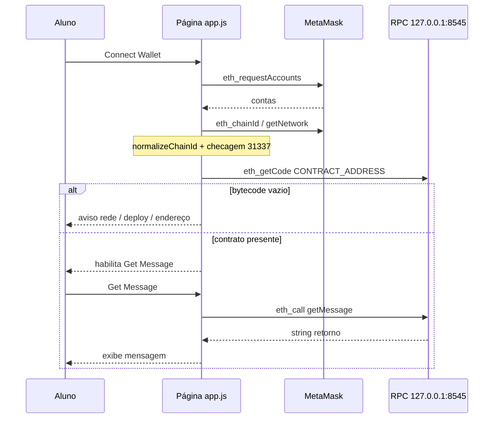

# Aula1 — Hello World Web3 (Hardhat + contrato + frontend + MetaMask)

Projeto mínimo porém **completo**: você sobe uma blockchain local, faz deploy de um contrato, abre uma página web e lê uma função do contrato pela carteira. O código foi pensado para **aula**, com mensagens de erro amigáveis, checagens de rede e um fluxo opcional para ensinar **EIP-3326 / EIP-3085**.

---

## Objetivo didático

Ao final, o aluno entende (e executa) um **ciclo Web3**:

1. Contrato inteligente na pasta `contracts/`.
2. Compilação e deploy com **Hardhat** na rede **`localhost`** (JSON-RPC em `127.0.0.1:8545`).
3. Frontend estático servido em **`http://localhost:3000`**.
4. **MetaMask** na **chain ID 31337**, conectada ao mesmo nó.
5. Chamada **off-chain** a uma função `pure` do contrato via **ethers.js v5**.

---

## Pré-requisitos

| Pré-requisito                                            | O que é / utilidade neste projeto                                                                                                         |
| -------------------------------------------------------- | ----------------------------------------------------------------------------------------------------------------------------------------- |
| **Node.js** (≥ 18)                                       | Runtime JavaScript; necessário para Hardhat, Express, scripts `npm` e `node frontend.js`.                                                 |
| **npm**                                                  | Instala as dependências do `package.json` e executa os scripts (`chain`, `deploy:local`, `frontend`, etc.).                               |
| **`hardhat`** (`devDependency`)                          | Ambiente de desenvolvimento Ethereum: compila Solidity, sobe o nó local (`npm run chain`), executa o deploy (`npm run deploy:local`).     |
| **`@nomicfoundation/hardhat-toolbox`** (`devDependency`) | Conjunto oficial de plugins (Hardhat + ethers v6 nos scripts, testes, etc.) carregado pelo `hardhat.config.js`.                           |
| **`express`** (`dependency`)                             | Servidor HTTP mínimo em `frontend.js` — serve a pasta `frontend/` em `http://localhost:3000` (evita `file://` com MetaMask).              |
| **`browser-sync`** (`devDependency`)                     | Usado em `npm run frontend:dev`: mesma porta 3000 com **reload** ao editar arquivos em `frontend/`.                                       |
| **Dois terminais** (recomendado)                         | Um mantém `npm run chain`; outro roda deploy e/ou `npm run frontend` sem derrubar o nó.                                                   |
| **Navegador** (ex.: Google Chrome)                       | Para abrir o dApp, instalar a MetaMask e, opcionalmente, anexar o debugger (ver `SETUP.md`).                                              |
| **MetaMask** (extensão)                                  | Carteira no navegador: rede Hardhat **31337**, RPC **127.0.0.1:8545**, assinatura de contas e chamadas ao contrato via `window.ethereum`. |

As dependências `npm` são instaladas com `npm install` na pasta deste projeto (exceto Node.js, npm, navegador e MetaMask, que você instala no sistema).

Para **instalação detalhada**, extensões do editor, Chrome em modo debug e passos da MetaMask, veja **`../SETUP.md`** (na pasta `codes/`).

### Instalação (dependências da aula-1)

Na pasta desta aula:

```bash
cd codes/aula-1
npm install
```

Se quiser validar o ambiente logo de cara:

```bash
npm run compile
```

---

## Estrutura do repositório

| Caminho                             | Função                                                               |
| ----------------------------------- | -------------------------------------------------------------------- |
| `contracts/HelloWorld.sol`          | Contrato com `getMessage()` (`pure` + string Unicode).               |
| `scripts/deploy.js`                 | Deploy do `HelloWorld`; imprime o endereço.                          |
| `hardhat.config.js`                 | Solidity 0.8.20; redes `hardhat` (in-process) e `localhost` (31337). |
| `frontend.js`                       | Servidor **Express** que serve apenas a pasta `frontend/`.           |
| `frontend/index.html`               | Página + `vendor/ethers` + `app.js`.                                 |
| `frontend/app.js`                   | Conexão MetaMask, rede, contrato, erros tratados.                    |
| `frontend/styles.css`               | Layout simples para projeção em sala.                                |
| `frontend/vendor/ethers.umd.min.js` | Bundle **ethers v5 UMD** local (ver decisões abaixo).                |

---

## Fluxo geral (passo a passo na aula)



### Fluxo interno no navegador (após carregar a página)



---

## Scripts npm

| Script                 | O que faz                                                                        |
| ---------------------- | -------------------------------------------------------------------------------- |
| `npm run compile`      | Compila os contratos.                                                            |
| `npm run chain`        | Sobe o nó local (RPC **8545**, chain **31337**).                                 |
| `npm run deploy:local` | Faz deploy em `--network localhost` (precisa do nó rodando).                     |
| `npm run frontend`     | `node frontend.js` — Express na porta **3000**.                                  |
| `npm run frontend:dev` | **Browser-sync** na porta 3000 com **reload** ao editar arquivos em `frontend/`. |

---

## Decisões técnicas (por que o código está assim)

### 1. ethers.js v5 via `frontend/vendor/` (e não só CDN)

Em alguns ambientes (extensões, **SES**/lockdown da MetaMask, bloqueio de CDN), o script do jsDelivr não expõe o global `ethers`, gerando `ReferenceError`. O bundle **UMD v5** versionado em `frontend/vendor/` é servido **na mesma origem** que a página, o que é mais previsível em sala.

O **Hardhat Toolbox** no projeto traz **ethers v6** para scripts Node; o **browser** usa **v5** de propósito, alinhado ao snippet didático (`Web3Provider`, etc.).

### 2. Express em `frontend.js`

Evita abrir o HTML como `file://`, o que pode atrapalhar APIs da extensão e comportamento do navegador. Nome **`frontend.js`** deixa claro que o papel é servir o front, não a lógica on-chain.

### 3. `defaultNetwork: "hardhat"` + rede `localhost`

- **`hardhat`:** rede **efêmera** usada por `compile`, `test` e `hardhat run` **sem** `--network localhost` — não substitui o `hardhat node`.
- **`localhost`:** aponta para o processo **`npx hardhat node`**; é o que o deploy da aula e a MetaMask usam.

**Nota:** Se existir **`HARDHAT_NETWORK=localhost`** no shell **sem** o nó ligado, comandos podem falhar até você remover a variável ou subir o nó.

### 4. `unicode"..."` no Solidity

Strings com emoji precisam do literal **`unicode"..."`** em Solidity 0.8+ para compilar.

### 5. Checagens no `app.js`

- **`normalizeChainId`:** `provider.getNetwork()` com MetaMask pode devolver `chainId` como `number`, não como `BigNumber`; normalizar evita `toNumber is not a function`.
- **`getCode` após conectar:** se não houver bytecode naquela rede, o botão “Get Message” não é habilitado e a mensagem orienta chain / deploy.
- **`friendlyWalletError` / `friendlyCallError`:** códigos como **4001** (usuário recusou) e **CALL_EXCEPTION** vazio ganham texto em **português** para a aula.

### 6. Feature flag `?showHardhatNetwork=1`

A seção “Adicionar ou mudar para Hardhat local” fica **oculta** por padrão. Com o query param (valores aceitos: `1`, `true`, `yes`, `on`), o professor mostra o **segundo caminho**: pedido de rede pelo site (**`wallet_switchEthereumChain`** / **`wallet_addEthereumChain`**), sem substituir o cadastro manual na MetaMask.

### 7. Provedor injetável (`getInjectableProvider`)

Com **várias carteiras**, `window.ethereum` pode expor **`providers[]`**; a função prioriza MetaMask quando existir.

---

## Troubleshooting rápido

| Sintoma                         | O que verificar                                                                                                                                       |
| ------------------------------- | ----------------------------------------------------------------------------------------------------------------------------------------------------- |
| `ethers is not defined`         | `vendor/ethers.umd.min.js` com status 200; servir via `npm run frontend`.                                                                             |
| `CALL_EXCEPTION` / sem bytecode | MetaMask na **31337**, mesmo **nó** que recebeu o deploy; após **reiniciar** `hardhat node`, rodar **deploy de novo** e atualizar `CONTRACT_ADDRESS`. |
| Porta 8545 em uso               | Outro `hardhat node` ou processo; encerre ou mude a porta (exige alinhar MetaMask e `hardhat.config.js`).                                             |

---

## Próximos passos naturais da disciplina

- Trocar `pure` por **`view`** com estado no contrato.
- Introduzir **transação** (escrita) e **gas**.
- Emitir **eventos** e ouvir no front.
- Deploy em **testnet** (ex.: Sepolia).

---

## Licença / uso

Material de aula; livre para uso e distribuição.
